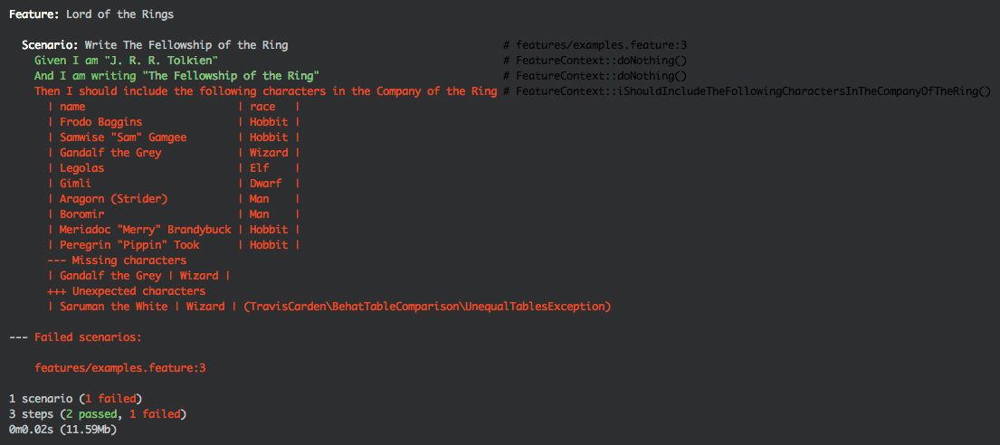

# Behat Table Comparison

[](https://packagist.org/packages/traviscarden/behat-table-comparison)
[](https://travis-ci.org/TravisCarden/behat-table-comparison)
[](https://codeclimate.com/github/TravisCarden/behat-table-comparison)
[](https://codeclimate.com/github/TravisCarden/behat-table-comparison/coverage)

The Behat Table Comparison library provides an equality assertion for comparing Behat `TableNode` tables.

## Installation & Usage

Install the library via [Composer](https://getcomposer.org/):

```bash
composer require --dev traviscarden/behat-table-comparison
```

Then use the [`TableEqualityAssertion`](src/BehatTableComparison/TableEqualityAssertion.php) class in your [`FeatureContext` class](http://docs.behat.org/en/v2.5/guides/4.context.html):

```php
<?php

use Behat\Behat\Context\Context;
use Behat\Gherkin\Node\TableNode;
use TravisCarden\BehatTableComparison\TableEqualityAssertion;

class FeatureContext implements Context
{

    /**
     * @Then I should include the following characters in the Company of the Ring
     */
    public function iShouldIncludeTheFollowingCharactersInTheCompanyOfTheRing(TableNode $expected)
    {
        // Get the data from the application and create a table from it.
        $application_data = [
            ['Frodo Baggins', 'Hobbit'],
            ['Samwise "Sam" Gamgee', 'Hobbit'],
            ['Saruman the White', 'Wizard'],
            ['Legolas', 'Elf'],
            ['Gimli', 'Dwarf'],
            ['Aragorn (Strider)', 'Man'],
            ['Boromir', 'Man'],
            ['Meriadoc "Merry" Brandybuck', 'Hobbit'],
            ['Peregrin "Pippin" Took', 'Hobbit'],
        ];
        $actual = new TableNode($application_data);

        // Build and execute assertion.
        (new TableEqualityAssertion($expected, $actual))
            ->expectHeader(['name', 'race'])
            ->ignoreRowOrder()
            ->setMissingRowsLabel('Missing characters')
            ->setUnexpectedRowsLabel('Unexpected characters')
            ->assert();
    }

}
```

Output is like the following:



## Examples

See [`features/bootstrap/FeatureContext.php`](features/bootstrap/FeatureContext.php) and [`features/examples.feature`](features/examples.feature) for more examples.

## Limitations & Known Issues

Some inequality detection currently works but does not yet display a helpful error message, because it has not been decided what it should show. Please help me [specify error messages for complex differences](https://github.com/TravisCarden/behat-table-comparison/issues/1).

## Contribution

All contributions are welcome according to [normal open source practice](https://opensource.guide/how-to-contribute/#how-to-submit-a-contribution).
