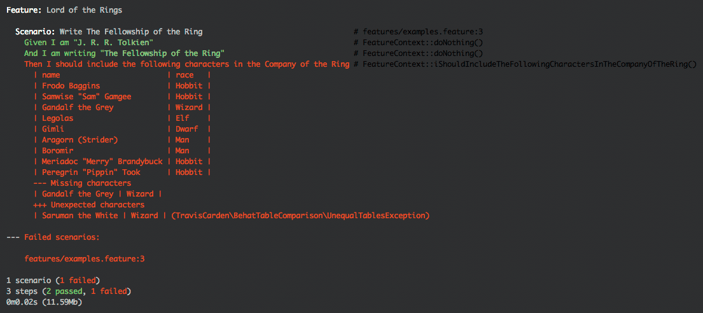

# Behat Table Comparison

[](https://packagist.org/packages/traviscarden/behat-table-comparison)
[](https://github.com/TravisCarden/behat-table-comparison/actions/workflows/main.yml)

The Behat Table Comparison library provides an equality assertion for comparing Behat `TableNode` tables.

## Installation & Usage

Install the library via [Composer](https://getcomposer.org/):

```bash
composer require --dev traviscarden/behat-table-comparison
```

Then use the [`TableEqualityAssertion`](../src/TableEqualityAssertion.php) class in your [`FeatureContext` class](http://docs.behat.org/en/v2.5/guides/4.context.html):

```php
<?php

use Behat\Behat\Context\Context;
use Behat\Gherkin\Node\TableNode;
use TravisCarden\BehatTableComparison\TableEqualityAssertion;

class FeatureContext implements Context
{

    /**
     * @Then I should include the following characters in the Company of the Ring
     */
    public function iShouldIncludeTheFollowingCharactersInTheCompanyOfTheRing(TableNode $expected)
    {
        // Get the data from the application and create a table from it.
        $application_data = [
            ['name', 'race'],  // Header row (required when using expectHeader(...)
            ['Frodo Baggins', 'Hobbit'],
            ['Samwise "Sam" Gamgee', 'Hobbit'],
            ['Saruman the White', 'Wizard'],
            ['Legolas', 'Elf'],
            ['Gimli', 'Dwarf'],
            ['Aragorn (Strider)', 'Man'],
            ['Boromir', 'Man'],
            ['Meriadoc "Merry" Brandybuck', 'Hobbit'],
            ['Peregrin "Pippin" Took', 'Hobbit'],
        ];
        $actual = new TableNode($application_data);

        // Build and execute assertion.
        (new TableEqualityAssertion($expected, $actual))
            ->expectHeader(['name', 'race'])
            ->ignoreRowOrder()
            ->setMissingRowsLabel('Missing characters')
            ->setUnexpectedRowsLabel('Unexpected characters')
            ->setDuplicateRowsLabel('Duplicate characters')
            ->assert();
    }

}
```

Output is like the following:



## Understanding Headers and Terminology

When using `expectHeader(...)`, it's important to understand the asymmetrical design:

- **Specified header**: The header you declare by calling `expectHeader(...)`. This is what the columns should be.
- **Expected table**: The table you provide as the first argument to `TableEqualityAssertion` (your test specification). Its first row must match the specified header and is stripped before comparison.
- **Actual table**: The table you provide as the second argument to `TableEqualityAssertion` (the application's real output). It is compared as-is with no header validation or stripping.

This design is intentional: test specifications typically include headers (e.g., from Gherkin), while application-generated output often does not.

## Error Message Specification

When tables are unequal, the assertion throws `UnequalTablesException` with a detailed
diagnostic message. The integer error code, available via `getCode()`, identifies the
category of failure:

| Constant                                     | When thrown                                                            |
|----------------------------------------------|------------------------------------------------------------------------|
| `UnequalTablesException::HEADER_MISMATCH`    | The header row does not match the expected header.                     |
| `UnequalTablesException::CONTENT_MISMATCH`   | Rows are missing, unexpected, or duplicated.                           |
| `UnequalTablesException::ROW_ORDER_MISMATCH` | The same rows are present but in a different order.                    |
| `UnequalTablesException::STRUCTURAL_ERROR`   | A structural failure occurred processing a table; see `getPrevious()`. |

Consumers should use the named constants rather than bare integers. For example:

```php
try {
    (new TableEqualityAssertion($expected, $actual))->assert();
} catch (UnequalTablesException $e) {
    match ($e->getCode()) {
        UnequalTablesException::HEADER_MISMATCH    => /* handle header issue */,
        UnequalTablesException::ROW_ORDER_MISMATCH => /* handle order issue */,
        default                                    => /* handle content issue */,
    };
}
```

For a complete list of stable/public guarantees, see [Contract Surface](contract-surface.md).

### Difference sections

- `--- Missing rows`: Rows present in expected but not in actual.
- `+++ Unexpected rows`: Rows present in actual but not in expected.
- `*** Duplicate rows`: Rows present on both sides with different multiplicity, shown as `(appears N time/times, expected M)`.

### Row-order diagnostics

When row order is respected and rows are out of order:

- `*** Row order mismatch` is shown.
- Per-row diagnostics are listed as `... should be at position X, found at Y`.
- Full order context is appended under:
    - `Expected order`
    - `Actual order`

When row content differs while respecting row order, semantic missing/unexpected/duplicate sections are shown first, then full expected/actual order tables.

### Header mismatch diagnostics

When `expectHeader(...)` is used and the expected table's first row does not match the specified header:

- `--- Expected header`: The header specification passed to `expectHeader(...)`
- `+++ Given header`: The expected table's first row (the test specification header that was provided)

### Label customization

All user-facing section labels are configurable via defaults plus getter/setter pairs:

- Missing rows
- Unexpected rows
- Duplicate rows
- Row order mismatch
- Expected header
- Given header
- Expected order subheading
- Actual order subheading

## Examples

See [`examples/bootstrap/FeatureContext.php`](../examples/bootstrap/FeatureContext.php) and [`examples/features/examples.feature`](../examples/features/examples.feature) for more examples.

## Contribution

All contributions are welcome according to [normal open source practice](https://opensource.guide/how-to-contribute/#how-to-submit-a-contribution).
